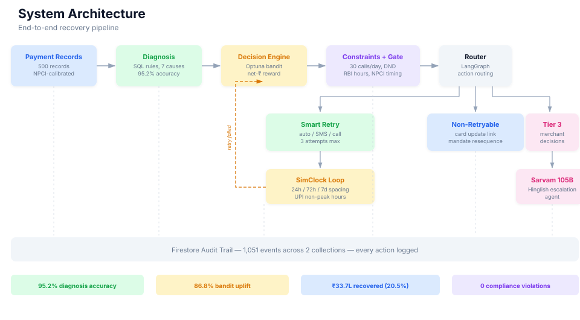

# Payzen: AI Revenue Recovery for Recurring Payments

**Razorpay AI Buildathon | Track 3: AI Revenue Recovery | Solo build**



| ₹33.7L automated recovery | ₹1.65Cr total at risk | 95.2% diagnosis accuracy | 86.8% bandit uplift | 0 compliance violations |
|---|---|---|---|---|

*₹33.7L recovered fully automatically (Tier 1 & 2). Additional recovery possible through merchant-approved escalation conversations (Tier 3) with 91 customers representing ₹89.5L.*

---

## The Problem

Recurring payment failures are one of the largest silent revenue leaks in Indian digital payments. Unlike one-time transaction failures (which have a 3-5% decline rate), recurring auto-debits (UPI AutoPay, eNACH mandates, card auto-debit) fail at dramatically higher rates. Published NPCI data shows business decline rates averaging roughly 74% across top 50 banks for AutoPay executions. At scale, this translates to crores of revenue quietly disappearing every billing cycle.

The root causes are diverse and require different interventions. Insufficient customer balance is timing-sensitive: retrying near payday works. Bank infrastructure outages are temporary: retry in hours, not days. Expired cards or mandates are permanent: retry is pointless, the customer needs to take action. AFA authentication gets stuck when customers don't complete a verification step: they need guidance. Deliberate mandate cancellations need a conversation, not automation. A single retry strategy cannot address all of these effectively.

Current retry systems typically use fixed timing (retry at T+1, T+2, T+3 days) with no diagnosis of why the payment failed, no intelligence about when to retry, no awareness of which customers to contact vs. leave alone, and no compliance guardrails around contact frequency or timing. Recoverable revenue goes unrecovered, and non-recoverable cases waste retry attempts.

This project builds an intelligent recovery layer that sits on top of existing payment infrastructure. It diagnoses the root cause of each failure, decides the optimal recovery action and timing, enforces regulatory compliance at every step, and for cases that need human judgment, surfaces them to the merchant with a recommendation rather than requiring them to inspect individual transactions.

---

## What This Does

500 failed recurring payment records go in. The system diagnoses why each one failed using SQL correlation rules (not an LLM), decides what to do about it using an Optuna-tuned contextual bandit optimizing for net ₹ recovered (not just success rate), enforces RBI contact hours, NPCI non-peak windows, DND registry, and per-customer contact limits, then executes the chosen action through a multi-attempt retry loop spanning simulated days.

Payments that can't be recovered through retries (expired cards, expired mandates, deliberate cancellations, AFA-stuck) are routed to dedicated action paths. Mandate cancellations and AFA-stuck cases surface as Tier 3 business decisions where a Sarvam 105B-powered Hinglish agent can have a recovery conversation with the customer. Every action is logged to Firestore with full transparency.

**Automated recovery (Tier 1 & 2):** ₹33.7L net recovered from ₹1.65Cr at risk across 299 retryable payments. 20.5% recovery rate. All actions executed without merchant intervention.

**Merchant-assisted recovery (Tier 3):** 91 cases (₹89.5L at risk) surfaced to the merchant for escalation conversations. Recovery from these depends on merchant decisions and customer responses, and is tracked separately.

312 cases reported as unresolved with categorized reasons.

---

## Key Results

| Metric | Value | How it was measured |
|---|---|---|
| Diagnosis accuracy | 95.2% | Held-out test split, 7 cause types, tuned on train split only |
| Bandit uplift (constrained) | 86.8% | vs. naive "retry after 6h" baseline, with capacity constraints active |
| Multi-attempt uplift | 62.3% | vs. single-pass retry (multi-attempt gives 3 chances over simulated days) |
| Automated net ₹ recovered | ₹33,76,860 | Tier 1 & 2 only, after subtracting all action costs (SMS ₹2, call ₹15) |
| Automated recovery rate | 20.5% | Net recovered / total at risk |
| Tier 3 cases surfaced | 91 | ₹89.5L at risk, recoverable through merchant-approved escalation |
| Action costs | ₹3,011 | Total cost of all SMS and call actions across the batch |
| Compliance violations | 0 | Contact hours, contact limits, DND, NPCI spacing: all enforced |
| Unresolved cases | 312 | 111 exhausted retries, 91 escalated, 107 pending non-retryable, 3 DND-blocked |

---

## Architecture

The pipeline processes each payment through six stages:

**Diagnosis:** SQL correlation rules running on SQLite. Detects bank outages by clustering failures sharing the same BIN prefix within a time window. Checks mandate expiry dates, AFA thresholds (₹15,000 general / ₹1,00,000 for SIP+insurance per RBI framework), customer payment history, and NPCI NACH return codes (04, 14, 59, 61). No LLM involved, fully explainable, fully deterministic. 95.2% accuracy on a held-out test set.

**Decision Engine:** Epsilon-greedy contextual bandit tuned with Optuna over 50 trials. 8 context features including cause, timing, amount, and pre-debit notification status. Reward function: net ₹ recovered (amount recovered minus action cost: ₹0 for auto-retry, ₹2 for SMS, ₹15 for call). The bandit learns that calling is only worth it for higher-value payments, and that insufficient-funds retries succeed more often near estimated payday.

**Constraints + Gate:** Capacity constraints (30 calls/day, per-customer limits: max 1 call + 3 SMS per billing cycle), RBI contact hours (8AM-7PM for calls), NPCI UPI AutoPay non-peak windows and spacing rules (24h/72h/7d), DND enforcement. The bandit recommends the ideal action; the constraint layer applies operational reality and logs every downgrade with a reason.

**Router:** LangGraph orchestration directing each payment to the correct action node based on diagnosis and decision output. Retryable causes go to Smart Retry. Expired cards go to Card Update Link. Expired mandates go to Mandate Resequence. Revoked mandates and AFA-stuck go to Tier 3 merchant decisions. Low-confidence diagnoses go to Escalation.

**Smart Retry + SimClock:** Multi-attempt retry loop using a simulated clock for time progression. Failed retries schedule the next attempt as a future SimClock event with correct NPCI spacing. The constraint tracker persists across attempts: daily call budget resets at day boundaries, per-customer limits span the full billing cycle. 551 total retry events across 299 retryable payments.

**Hinglish Escalation:** For mandate_revoked (customer deliberately cancelled) and afa_stuck (customer needs authentication guidance). Sarvam 105B generates contextual Hinglish responses via few-shot prompting with curated conversation transcripts. Conversation state tracker captures outcomes: promise-to-pay, interest in downgrade, completed authentication, refusal, callback request. Template-based fallback if the model is unavailable.

---

## Tiered Approval System

Not every action needs merchant approval. The system uses three tiers:

**Tier 1 (automated):** Silent retries, timing optimization, constraint enforcement. The merchant never sees these. They execute automatically and results appear in the dashboard.

**Tier 2 (policy-driven):** The merchant configures preferences once (enable SMS, enable calls, minimum amount for calls, brand name, call tone). The system applies these policies to every action automatically.

**Tier 3 (business decisions):** Mandate cancellations and AFA-stuck cases need merchant judgment. Should we offer a discount? A different plan? Should we guide the customer through authentication? These surface in the Decisions tab with a recommendation. The merchant approves, rejects, or starts a recovery conversation.

---

## Research & Data Calibration

The synthetic dataset is not randomly generated. Every distribution parameter is calibrated against published Indian payment system data:

- **NPCI UPI Ecosystem Statistics:** bank-wise transaction volumes, approval rates, business decline rates, downtime incidents. Directly informed bank distribution weights and outage clustering patterns.
- **NPCI NACH Circular NPCI/2024-25/NACH/006:** real standardized return codes (04, 14, 59, 61) used in place of made-up descriptive strings.
- **RBI Digital Payments E-Mandate Framework 2026:** dual AFA threshold (₹15,000 general / ₹1,00,000 for SIP, insurance, credit card bills), pre-debit notification rules, mandate lifecycle.
- **Business Standard (Sep 2025):** 20M UPI AutoPay mandates revoked monthly, SBI AutoPay approval rate ~30%, 74% average business decline rate.
- **VyaparGateway:** peak failure periods (month-end, late night batch processing, post-holiday spikes), UPI failure rate breakdowns.

An independent research validation pass confirmed the data distributions and found 5 additional sources not in the original research, resulting in 4 enhancements: real NPCI codes, payment categories with dual AFA thresholds, mandate revocation as a separate cause, and pre-debit notification status.

Full source documentation with per-source attribution: `/references/sources.md`
Data validation report: `/data/VALIDATION_REPORT.md`

---

## Technical Decisions

**SQLite over Neo4j for diagnosis.** Every diagnosis rule (BIN-cluster detection, mandate-expiry check, AFA-threshold check, low-balance heuristic) is a filter/aggregation, not a relationship traversal. A graph database would add setup complexity without enabling anything a `GROUP BY` / `WHERE` can't do.

**Cost-aware bandit reward.** The reward function subtracts action cost from recovered amount. Without this, the bandit learns "always call everyone" because calling has the highest success rate and ₹15 is trivial vs. payment amounts. With cost-awareness plus capacity constraints, the system prioritizes high-value payments for limited call slots and falls back to SMS for the rest.

**Tiered approval over per-action approval.** An earlier design had 279 individual approve/reject buttons for retry actions. Every rational merchant would approve all of them. The redesign recognizes that retries and notifications are policy decisions (configure once), not individual choices. Only genuine business decisions (discount offers, churn decisions) need merchant judgment.

**Few-shot prompting over fine-tuning.** LoRA fine-tuning on free-tier GPUs carries real risk: session timeouts, OOM crashes, and no time buffer. Few-shot prompting with Sarvam 105B produces 83% quality on the evaluation rubric with zero GPU dependency.

---

## The 2AM Bug

During testing, stress tests revealed that the constraint tracker was blind to half the pipeline.

The system has two phases: Phase 1 processes all 500 payments through the LangGraph pipeline and schedules retryable ones into the SimClock event queue. Phase 2 pops events from the queue and executes retries. The ConstraintTracker enforces per-customer contact limits (max 1 call, 3 SMS per billing cycle) and DND.

Phase 1 bypassed the tracker entirely. When a payment was scheduled for retry with `call_then_retry`, the tracker never recorded it. Phase 2 only tracked the *next* action, not the current one, so the counter was always one behind.

Result: CUST_00314 received 2 phone calls (max 1). CUST_00348 received 5 SMS (max 3). CUST_00176, who was on the DND registry, received an SMS.

Fix: three changes across `run_batch_multi.py` and `retry_processor.py`. DND check before scheduling in Phase 1, constraint recording in Phase 1, and current-action tracking in Phase 2. A companion bug in the audit trail (logging pre-constraint actions instead of actual actions) was fixed simultaneously.

This is a compliance violation that went undetected through all unit tests. It was caught by adversarial stress tests that verified per-customer contact totals across the full batch.

---

## Production Path

This system is designed as an add-on to Razorpay's existing subscription infrastructure:

- **Data ingestion:** Razorpay's Subscriptions API emits `subscription.pending` webhooks when recurring payments fail. The same pipeline processes live webhook events with no architectural changes.
- **Escalation delivery:** Recovery conversations delivered via WhatsApp Business API. 90%+ open rates, two-way async messaging, natural channel for Indian customers.
- **Multi-tenant:** Each merchant sees only their own data. Razorpay's platform view aggregates cross-merchant intelligence.
- **Cross-merchant bank intelligence:** If SBI is down for one merchant, it's down for all. A platform-level view enables proactive outage detection before individual merchants notice.

---

## Repository Structure

```
/data          - synthetic data generation, train/test splits, validation report
/simclock      - simulated clock service + event queue
/diagnosis     - SQL-based diagnosis engine + evaluation
/decision      - contextual bandit, Optuna tuning, stopping rules, constraints
/action        - LangGraph pipeline, action nodes, multi-attempt batch runner
/voice         - Hinglish transcripts, escalation agent, conversation state tracker
/audit         - Firestore logger, metrics, exceptions, summary scripts
/backend       - FastAPI server, pipeline runner, merchant config
/dashboard     - React + Vite + Tailwind frontend
/references    - research sources, Worldline report, citations
/docs          - engineering notes, architecture diagram, objectives slides
/tests         - 69 tests across 7 suites
```

See [SETUP.md](SETUP.md) for installation and running instructions.
